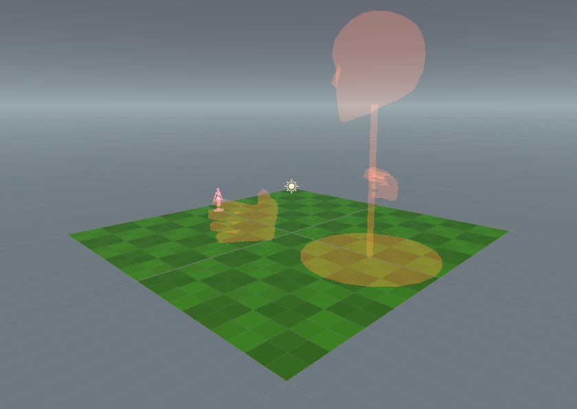

# Getting started

?> If you're completely new to Unity it might be a good idea to learn the basics of the Unity interface. 
The first couple videos in the [Using the Unity Interface](https://learn.unity.com/tutorial/using-the-unity-interface?uv=2020.3) tutorial by Unity are a good place to start. 

## Installing Unity

To begin with we'll want to download and install Unity.

The easiest (and recommended) way to install Unity is via the Unity Hub. It can be downloaded and installed from [here](https://unity3d.com/get-unity/download/archive). 

Once you've downloaded and installed Unity Hub, you'll then need to grab Unity 2020.3.24. 
Make sure to also install `Android Build Support` along side it, as it is needed for Quest support. 
[Heres a convenient Unity Hub link!](unityhub://2020.3.24f1/79c78de19888)
(if that doesn't work you can also grab it from [here](https://unity3d.com/get-unity/download/archive))

?> Make sure you are using **exactly** version 2020.3.24, as maps exported with other Unity versions may fail to load correctly. 

Now create a new, empty 3D project to build your map in and open it. 

Once that project has loaded, download the [Govigedit package](https://drive.google.com/file/d/1ZsPG0WE9FezCTqkH9dm6najmleC-5Dmn/view?usp=sharing) 
(if you haven't already), and import it either by double-clicking on it in File Explorer, 
importing it via `Assets -> Import Package -> Custom Package`, or dragging the package onto the Hierarchy. 

## Creating a very basic map. 

We'll want to create a new scene in the project panel (a scene is essentially a level), name it something fun (BirdSanctuary for example) and open it. 

Delete the main camera, as it can cause issues. 

Create a plane, right click on it's Transform in the Inspector, and click reset. 
- I've also set it's scale to `2, 2, 2` so there's a little more room. 
- I've also given it the `GridCliff` material from `Davigo/Common/Materials/Level`.

Create a Giant spawn position and Warrior spawn position. These can be found in `Assets/Davigo/Common/Prefabs`. 

We'll also need a killzone so the warrior respawns when they fall off. This can be found in `Assets/Govidad/Govigedit/Package/Prefabs`. 

Finally, we'll need a GameObject with the `MapSettingsComponent` on it. You can find an example prefab in `Assets/Govidad/Govigedit/Package/Prefabs`. 
In said `MapSettingsComponent`, you can find fields for the map's name, description, the author, as well as a preview image. 

> The preview image and description is currently unused, however in later versions it will work the same as local, so i'd still recommend setting them. 

Once you've done all of that, save your masterpiece and export it via `Govigedit/Export Map` (This can be found in the top bar). 

Once the map has finished exporting, fire up the prototypes, and create an Online Lobby. Your map should be within the normal map dropdown. 
You can then load it up and have a look!

This map obviously isn't going to win any awards, but this basic setup is mostly required for each map you create. 
(The plane can be swapped out for your map terrain of course)