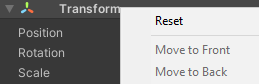
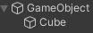
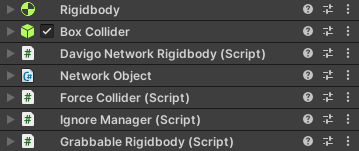

# Creating Rigidbody Objects

?> What does this allow? Rigidbodies (physics object) allow map makers to make their own special throwable objects! Such as a barrel, crate, and pretty much anything you can think of.

!> Since writing this tutorial, we have included an object builder which should make this process drastically easier. We recommend using that instead of the below. It can be found under Govigedit > Interactable Builder. 

## Setting up your rigidbody

To begin making a custom rigidbody, you want to create an empty game object and reset its transform. This will set its location to 0, 0, 0 on your map, to keep everything in line. Feel free to name this whatever you want, as it affects nothing. For this we will simply leave it as GameObject, but if you are making something such as a barrel, it would be best to name it that for organization sake.

 

## Visuals

Now, you will want to add whatever you would like the object to look like as a child of the object, and this can be done by dragging and dropping your object onto the empty game object, in the hierarchy, and resetting the transform of the object. In this case, we'll be using a cube, but this can be whatever you want.

 

## Required Components

 Once that is complete, we can begin adding our components. Now the components you will need are going to be listed here. These can be added in any order, just make sure you have them all! Otherwise there will be issues with your rigidbody. (You can find out what each of them do in [the components list](components.md))

 

## Interpolation Targets

 If you expand all your components, you may see that your Davigo Network Rigidbody has no Interpolation Target. To fix that, rename the visuals to "Art" (doesn't have to be named this, but is named this out of convention) and drag the visuals onto the Interpolation Target field.

!> The interpolation target's scale will get set to the Rigidbodies scale every frame, so make sure if you're changing the art's scale, that you're changing the rigidbody's, not the art's.  

!> Make sure the visuals only has a Mesh Renderer and Mesh Filter or Particle System!

?> Why do we do this? In order to hide lag and jitter, DAVIGO interpolates (smooths the movement between ticks) the visuals. Doing this to the networked object would have issues, so we only do it to the visuals.
